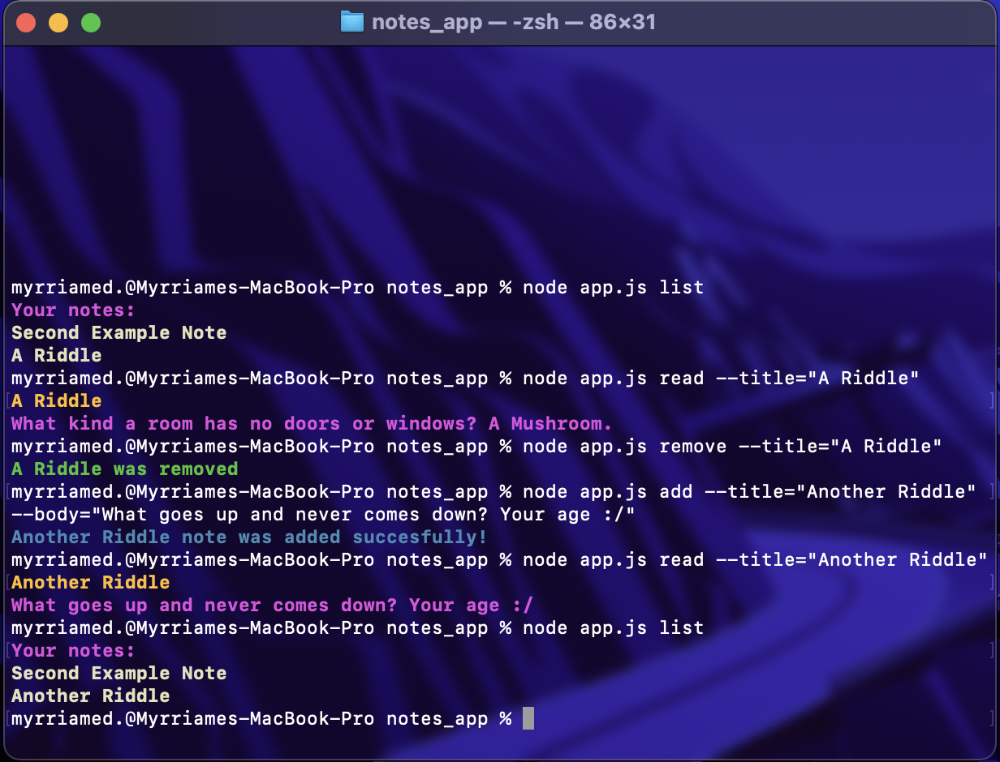

# **Node.js Notes App!**
Used npm packages [Chalk](https://www.npmjs.com/package/chalk) & [Yargs](https://www.npmjs.com/package/yargs).

Created commands that add, remove, list, or read notes.

*code contains notes*

###Demo:

